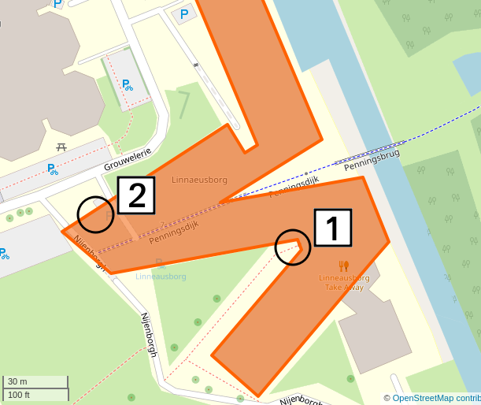

# informalr

Branch   |                                                      |
---------|--------------------------------------------------------------------------------------------------------------------------|-------------------------------------------------------------------------------------------------------------------------------------------------------
`master` | |
`develop`||
`anne`   |   |
`geert`  |  |
`harry`  |  |
`maxim`  |  |
`pedro`  |  |
`richel` | |
`stefano`||
`lizzie` | |
`willy`  |  |
`claudio`  |  |
`frans`  |  |

 * Branches are ordered `master`, `develop`, then topic branches alphabetically

The `informalr` R team!

## Team

 * [Anne](https://github.com/fastnotfurious)
 * [Geert](https://github.com/bogeert)
 * Harry
 * [Maxim](https://github.com/MaximBaranov87)
 * [Pedro](https://github.com/Neves-P)
 * [Stefano](https://github.com/swom)
 * [Lizzie](https://github.com/Lizzie-Roeble)
 * [Willy](https://github.com/FrieseWoudloper)

## Meetings

 * Date: Tuesday August 25 2020, then every Tuesday
 * Time: 18:00-20:00
 * Where IRL: meeting room 5171.708, Linnaeusborg, Zernike
 * Where online: Discord.

> Map of the Linneausborg. [1] main entrance [2] meeting room 5171.708

We follow this timetable:

What                     | Time
-------------------------|------
Richel @ LB main entrance|18:00
Doors open               |18:05
Work starts              |18:15
Break time!              |19:00
Work continues           |19:15
End of lesson            |20:00

## Coding via Discord

For those that prefer online, we use Discord to chat.
To join, send Richel a Discord Friend Request: `richelbilderbeek#9002`.
He'll add you to the `informalr` server.

## Project

Unknown, see [https://github.com/informalr/informalr/issues/8](https://github.com/informalr/informalr/issues/8).

## Long-term schedule

Week|Activity
----|----------
 35 |Teach newbies, start suggesting projects, start vignettes, vote for deadline
 36 |Remind projects
 37 |Vote for project(s)
 38 |.
 39 |.
 40 |.
 41 |Autumn holiday
 42 |.
 43 |.
 44 |.
 45 |.
 46 |.
 47 |.
 48 |.
 49 |.
 50 |.
 51 |.
 52 |Christmas holiday

## FAQ

### What is the goal of `informalr`?

To learn how to develop professionally in a team in an informal setting using R.

### What is meant by 'professionally'?

That we follow the literature, which means we will:

 * Use a package as a development unit (not an R script, not a vignette)
 * Use `git` for version control, where each person has his/her own branch
 * Use GitHub for collaboration
 * Employ test-driven development
 * Use Travis CI for continuous integration
 * Use `lintr` to check for style
 * Use `covr` to check for code coverage
 * Use `goodpractice` for miscellaneous good practices

See, for example, [here](https://github.com/richelbilderbeek/PresentationsAboutR)
for multiple videos we will follow.

### What is meant by 'in a team'?

That we work together.
A beginner will be taught by a more experienced team member.
We will be doing pair programming.

### What is meant by 'informal'?

This means that:

 * You are allowed to grab a beer
 * If you cannot be there, this is always fine
 * We only work during our meetings

### How will we do that?

By working on projects as a team. In practice, we will be writing packages.

### What projects will we be working on?

First, we'll write some trivial packages to get used to the workflow.
After this, the team decides on a project by majority vote.

To be precise, you will learn, in this order:

 * `git` minimal workflow: add, clone, commit, pull, push
 * R package minimum: tests, writing trivial functions by copying existing code
 * `git` branching: checkout, merge
 * R package basic: write simple functions, write vignettes
 * Projects

### What should my minimal level be?

There is none.

### I am new, what should I do?

  1. Create a Discord account, send Richel a Discord Friend Request: `richelbilderbeek#9002`, so he can add you to the tresinformal Discord group
  2. Create a GitHub account, share it with a team member so he/she can add you to the `informalr` team
  3. Suggest a project: [https://github.com/informalr/informalr/issues/8](https://github.com/informalr/informalr/issues/8)

Note: if the Issue is closed, re-open it, assign yourself, 
move the Issue to 'In Progress'. Close the Issue after fixing it. Welcome
to our workflow :+1:

  4. Do a trivial `git push` to `master`, [https://github.com/informalr/informalr/issues/11](https://github.com/informalr/informalr/issues/11)
  5. Create your own branch using the GitHub web interface, [https://github.com/informalr/informalr/issues/13](https://github.com/informalr/informalr/issues/13)
  6. Do a trivial `git push` to your branch, [https://github.com/informalr/informalr/issues/15](https://github.com/informalr/informalr/issues/15)

Frans rules because he is a complete idiot l
