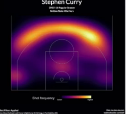
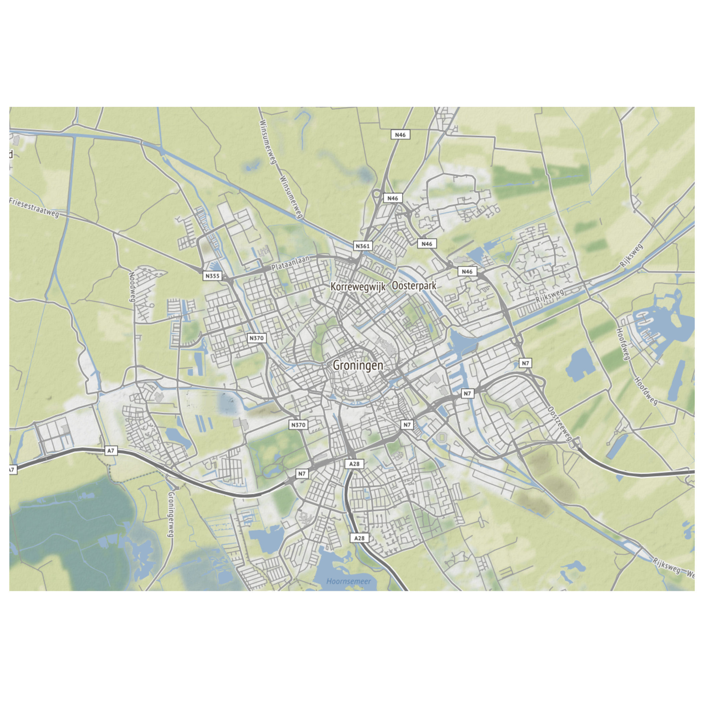

# informalr

Branch   ||
---------|-------------------------------------------------------------------------------------------------------|-------------------------------------------------------------------------------------------------------------------------------------------------------
`master` |   |
`develop`|  |
`alexine`|  |
`bara`   |     |
`claudio`|  |
`frans`  |    |
`geert`  |    |
`jan`    |      |
`richel` |   |
`stefano`|  |
`willy`  |    |

 * Branches are ordered `master`, `develop`, then topic branches alphabetically

The `informalr` R team!

## Project

Hiking guide to help hikers spot busy routes/stops before they embark on a hike. 
This show a somehow similar idea:

This is a stub of something more tailored to ours:

## Team

Ordered alphabetically on first name:

Name                                         |Role
---------------------------------------------|-----------------
[Alexine](https://github.com/alexinedewit)   |Junior
[Bara](https://github.com/barawaclawik)      |Newbie
[Claudio](https://github.com/janclod)        |Medior
[Frans](https://github.com/fransbianchi)     |Junior
[Geert](https://github.com/bogeert)          |Junior, back-end
[Jan](https://github.com/janderkkotlarski)   |Newbie
[Lizzie](https://github.com/Lizzie-Roeble)   |Newbie
[Richel](https://github.com/richelbilderbeek)|Team leader
[Stefano](https://github.com/swom)           |Newbie 
[Willy](https://github.com/FrieseWoudloper)  |Medior

## Meetings

The informalr team is now working on [snackman](github.com/informalr/snackman).

## Code of Conduct

See [CODE_OF_CONDUCT.md](CODE_OF_CONDUCT.md).

In case it is undesirable to email Richel,
contact [friesewoudloper](https://github.com/friesewoudloper).

#### Open data sources
* [Public transport data NDOV loket](https://data.ndovloket.nl/)
* [OpenStreetMap Overpass API](https://overpass-turbo.eu/)
* [Nationaal Dataportaal Wegverkeer](http://opendata.ndw.nu/),
  or [https://www.ndw.nu/pagina/en/78/database](https://www.ndw.nu/pagina/en/78/database)
  or [https://www.ndw.nu/pagina/en/78/database/79/real-time_traffic_data/](https://www.ndw.nu/pagina/en/78/database/79/real-time_traffic_data/)

#### Related projects

 * Object Detection with YOLO and MobileNet SSD: https://github.com/dannylee1020/object-detection-app
 * Realtime bus dashboard: https://shiny.rstudio.com/gallery/bus-dashboard.html
 * Source code: https://github.com/rstudio/shiny-examples/tree/master/086-bus-dashboard

### Misc

 * Shiny tutorial: https://github.com/FrieseWoudloper/shiny-workshop

## Progress

### 2020-11-24

### 2020-10-27

Video: [YouTube](https://youtu.be/Pc1e-9WiDuM) [Download](http://richelbilderbeek.nl/informalr_20201027.ogv)

